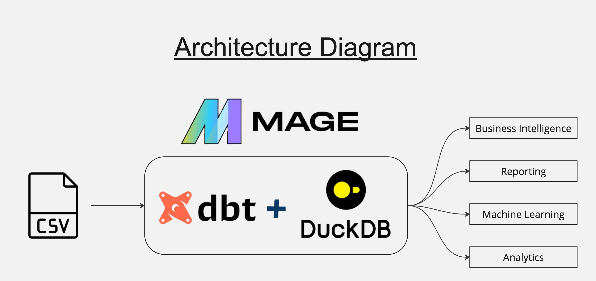

# 🛒 E-Commerce Data Warehouse using dbt + DuckDB + Mage

Welcome to the **E-Commerce Data Warehousing** project! This end-to-end pipeline showcases how to model, transform, and analyze raw transactional data using modern data tooling — all built from a single CSV file input.

---

### 🧭 Overall Architecture

High-level architecture showing how Mage, dbt, and DuckDB work together:



---

## 🚀 Tech Stack

| Tool         | Purpose                                      |
|--------------|----------------------------------------------|
| **CSV File** | Raw source data                              |
| **dbt**      | SQL-based data transformation                |
| **DuckDB**   | Lightweight OLAP DB for analytics            |
| **Mage**     | Workflow orchestration and scheduling        |

---

## 🧱 Project Structure

```

├── dbt\_duckdb\_dwh/
│   ├── models/
│   │   ├── marts/
│   │   ├── staging/
│   │   └── sources/
│   └── macros/
├── mage/
│   └── pipelines/
│       └── refresh\_dbt\_pipeline/
└── sales.csv

````


### 🧩 Mage Pipeline Flow

Orchestrated through Mage to first **refresh source CSV data** and then **run dbt transformations**:


## 🧾 Dataset Summary

Source: `sales.csv`  
Contains synthetic e-commerce transactions with columns like:

- `transaction_id`, `transactional_date`
- `product_id`, `customer_id`
- `cost`, `price`, `quantity`, `payment`, etc.

These are cleaned, transformed, and modeled across staging and mart layers using dbt.

---

## 🧠 Use Cases

This pipeline supports:

- 📈 Business Intelligence & Dashboards  
- 📊 Reporting for customer/product/payment trends  
- 📉 Profitability analysis & margin tracking  
- 🤖 Feeding cleaned data into ML models


---

## 🤝 Acknowledgements

This project is powered by:

* [dbt](https://www.getdbt.com/)
* [DuckDB](https://duckdb.org/)
* [Mage](https://www.mage.ai/)

Built with ❤️ by Divine Sam.


